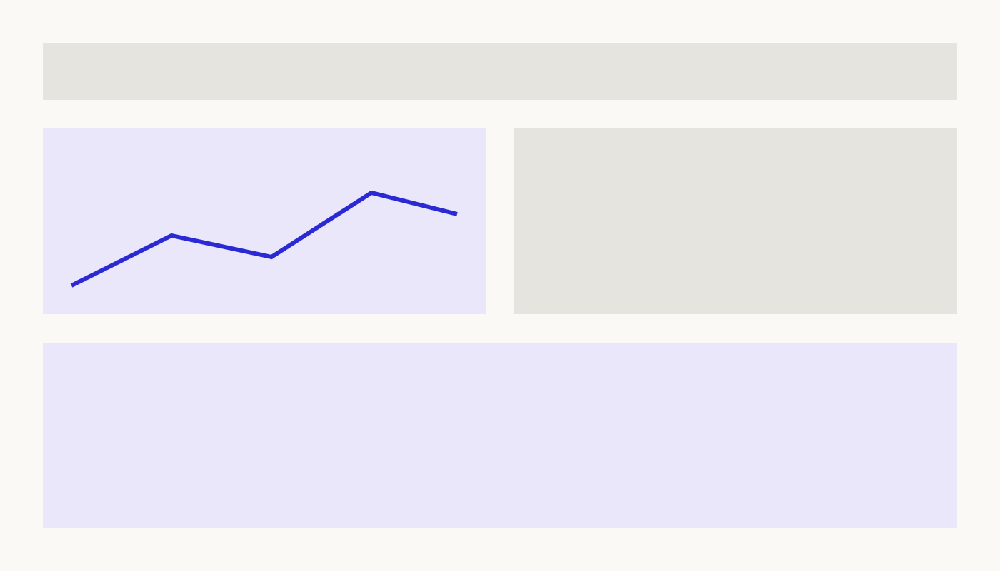

_This is a sample case-study project. Duplicate this folder, drop in your images, and edit `index.md` — the page below renders automatically._

## Context

A water utility needed a single view across production volumes, revenue collection, and operational incidents. The existing reporting was a patchwork of spreadsheets updated by hand.

## Approach

Plain markdown paragraphs and images work out of the box. Reference images with relative paths:

## Outcome

Headings, lists, and quotes all get the default article styling:

- Consolidated three data sources into one pipeline
- Monthly reporting time cut from days to minutes
- Forecasts reviewed in weekly operations meetings

> For finer layout control, rename this file to `index.mdx` and use the built-in `<Figure>`, `<Gallery>`, `<TwoColumn>`, `<FullBleed>`, and `<Video>` components — no imports needed.
